# Updated Implementation Plan & Hackathon Roadmap - Nika AI

This roadmap is optimized for a 7-day hackathon. It prioritizes vertical execution, immediate demoability at the end of each sprint, and minimal infrastructure overhead.

---

## Simplified Hackathon Architecture

To avoid overengineering and maximize development speed:
*   **Database**: SQLite via SQLAlchemy (local file-based, zero setup overhead).
*   **Background Tasks**: Python standard library `BackgroundTasks` instead of Celery and Redis.
*   **Vector Search**: Defer FAISS/Vector Database setup until the Reports + Memory sprint (local in-memory or lightweight SQLite extension if needed).
*   **Deployment & Environments**: Local development using standard hot-reloading (uvicorn + Vite dev) first. Dockerize and configure containers only for cloud deployment in Sprint 6.
*   **Core Principle**: Every sprint produces a testable, visual, and functional vertical slice (frontend to backend to AI).

---

## 7-Day Sprint Roadmap

```mermaid
gantt
    title Nika AI Hackathon Timeline (7 Days)
    dateFormat  X
    axisFormat %d
    section Development Sprints
    Sprint 1: Image to YOLO to API       :active, 0, 1
    Sprint 2: Webcam & Live Streaming    : 1, 2
    Sprint 3: Gemma Copilot & Chat       : 2, 3
    Sprint 4: AI Trust Engine (Explain)  : 3, 4
    Sprint 5: Reports & SQLite History   : 4, 5
    Sprint 6: Deployment on AMD Cloud    : 5, 6
```



### Sprint 1: Image → YOLO → Prediction API
*   **Goal**: Enable a user to upload a static image of a product and receive YOLO defect detections and bounding boxes.
*   **Features**:
    *   Initialize repository layout (`backend/`, `frontend/`, `ai/`).
    *   Integrate YOLOv8 model loading wrapper in `ai/yolo`.
    *   Expose FastAPI `/api/v1/predict` endpoint accepting image uploads.
    *   Create a simple React upload UI that displays the uploaded image with defect bounding boxes overlaid.
*   **Working Demo**: Upload a sample product image (e.g. PCB, casting) and view bounding boxes on the frontend.

### Sprint 2: Webcam → Live Streaming
*   **Goal**: Turn any smartphone/webcam into a live quality inspector.
*   **Features**:
    *   Implement frontend webcam capture using React hooks and HTML5 Canvas.
    *   Stream video frames to backend via WebSocket or high-frequency HTTP requests.
    *   Return processed frame data with overlay coordinates.
*   **Working Demo**: A live-streamed webcam viewport showing real-time defect overlays and processing latency.

### Sprint 3: Gemma Copilot Integration
*   **Goal**: Add interactive chat assistance for factory workers.
*   **Features**:
    *   Integrate Gemma 4 via Fireworks AI API (or local inference if optimized).
    *   Provide prompt templates for defect troubleshooting and manufacturing procedures.
    *   Add Gemma Chat component to the React UI.
*   **Working Demo**: A chat interface where the worker can ask "How do I fix the solder bridge defect shown on machine 3?" and receive step-by-step guidance.

### Sprint 4: AI Trust Engine
*   **Goal**: Estimate confidence, prevent hallucinations, and explain defects.
*   **Features**:
    *   Implement Trust Engine metrics (e.g., confidence thresholds, spatial check validation).
    *   Generate natural language descriptions explaining *why* YOLO flagged a region as a defect.
*   **Working Demo**: Hovering over a defect bounding box displays a "Confidence Analysis" and an explanation (e.g., "Confidence: 89%. Solder blob exceeds standard area threshold by 45%").

### Sprint 5: Reports + History
*   **Goal**: Persist inspection history in SQLite and generate downloadable PDF reports.
*   **Features**:
    *   Set up simple SQLite database schema (Users, Inspections, Defects, Reports).
    *   Create a historical dashboard listing past runs.
    *   Write a PDF generator using ReportLab or custom HTML templates.
*   **Working Demo**: A dashboard page showing past inspection logs with filters and a "Download PDF Report" button for any run.

### Sprint 6: Deployment on AMD Developer Cloud
*   **Goal**: Deploy the functional MVP to AMD Cloud infrastructure.
*   **Features**:
    *   Construct optimized Dockerfiles.
    *   Set up `docker-compose.yml` for unified execution.
    *   Deploy on AMD Cloud VPS/GPU instance.
*   **Working Demo**: The entire application running on a public IP/URL accessible on a smartphone.

---

## Key Dependencies

### Backend (`backend/requirements.txt`)
```text
fastapi==0.111.0
uvicorn[standard]==0.30.1
pydantic==2.7.4
sqlalchemy==2.0.31
ultralytics==8.2.50
opencv-python-headless==4.10.0.84
torch==2.3.1
transformers==4.42.3
httpx==0.27.0
pytest==8.2.2
```

### Frontend (`frontend/package.json`)
```json
{
  "dependencies": {
    "react": "^18.3.1",
    "react-dom": "^18.3.1",
    "lucide-react": "^0.395.0",
    "framer-motion": "^11.2.10",
    "axios": "^1.7.2",
    "@tanstack/react-query": "^5.45.1"
  },
  "devDependencies": {
    "vite": "^5.3.1",
    "typescript": "^5.4.2",
    "tailwindcss": "^3.4.4",
    "postcss": "^8.4.38",
    "autoprefixer": "^10.4.19"
  }
}
```
